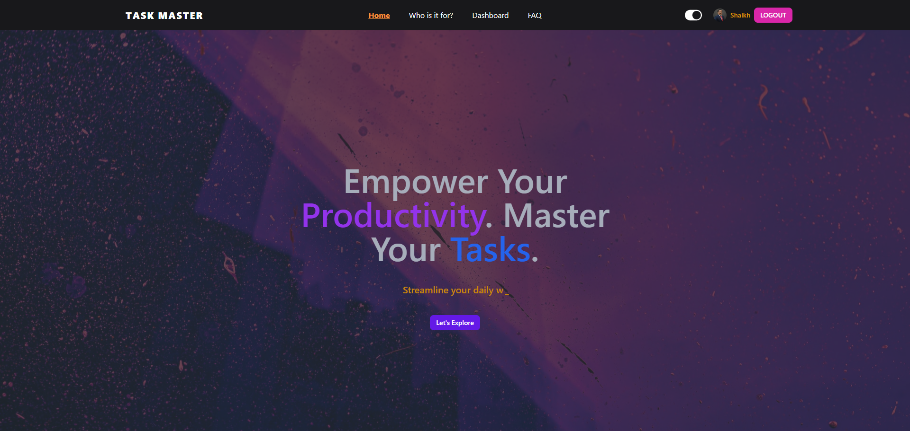

# Task Master Client Website

A simple responsive task management platform using React.js, Firebase Auth, Express.js, and MongoDB. The platform aims to enhance and improve user task management.

### Live Site Screenshot



### Technologies Used

[](https://skillicons.dev)

### React Libraries Used

- tanstack-query, axios, lottie-react, react-beautiful-dnd, react-hook-form, react-hot-toast, react-icons, react-simple-typewriter, styled-components, sweetalert2.

## Getting Started

Follow these steps to clone and run the project on your local machine.

Clone the repository and navigate to the cloned repo.

#### Install Dependencies

```bash
npm install
```

#### Configure Environment Variables

You will be needing the environment variables for Firebase SDK before running the project. Please contact me if you need access to the .env.local file.

#### Run the Project

After configuring the environment variables, run this command to start the project.

```bash
npm run dev
```

### Features & Functionalities

- Click on `Let's Explore` to sign up or sign in using email, password or Google to get access to your personalized dashboard.
- Visit the `ADD A TASK` page to add your task by deadline and priority.
- Explore your tasks on the `MY TASKS` page to manage your tasks and perform cool operations like drag-and-drop your task status.
- Click on the `Delete` button to delete a specific task or the `Edit` button to update its details.

### Client Side Live Link:

[Firebase](https://task-master-66.web.app/) : https://task-master-66.web.app/
